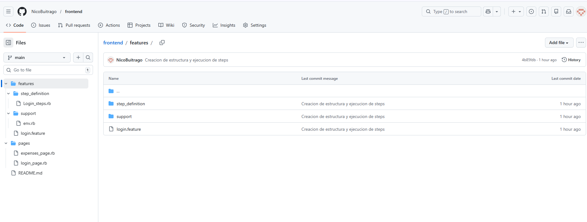

## EXPLICACION

API pública Reqres es un servicio demo y presenta dos limitaciones:

El usuario creado con POST /users no se persiste, por lo que el GET /users/{id} puede responder 200 o 404.

En algunos momentos el endpoint responde HTTP 403 debido a mecanismos de protección (Cloudflare), devolviendo contenido HTML en lugar de JSON.

Por este motivo, el test:

Valida 201 o 403 como comportamiento esperado del POST.

Ejecuta validaciones completas (ID, contrato y GET) solo cuando la API responde 201.

Se adjunta evidencia de la respuesta 403 obtenida desde Postman para confirmar que la limitación es externa al código

